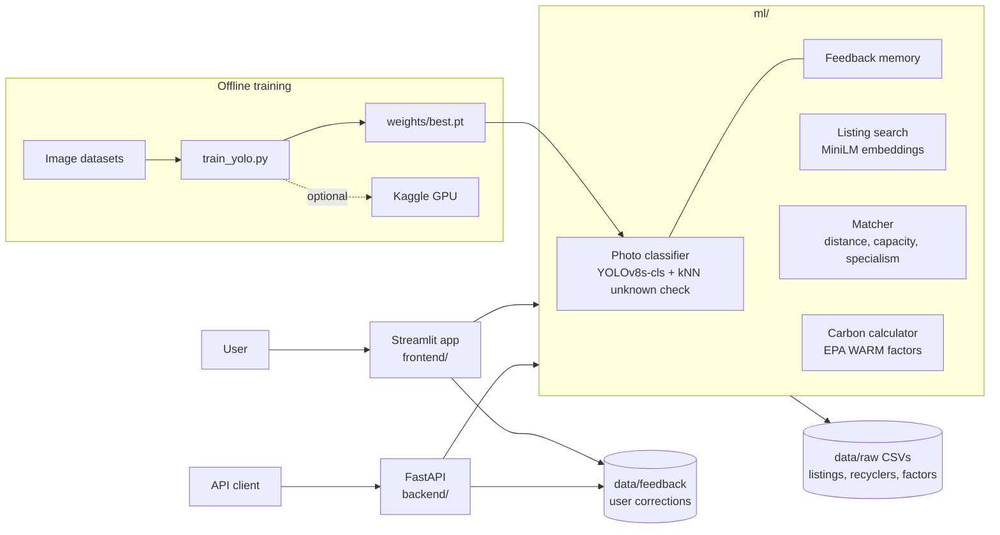

# MaterialMatch

AI waste-to-feedstock matching for Bengaluru. A waste generator uploads a photo, the model identifies
the material, and the app suggests nearby recyclers and estimates the CO₂e saved by recycling it.
Manufacturers can search listed waste in plain words.

> **Demo data.** All 205 waste listings and the 10 recycler profiles are synthetic samples, not real
> businesses or partnerships. Most carbon factors are proxies (EPA WARM) and are flagged in the app.

## Features

- **I have waste**: photo classification (9 waste types, 27 sub-types), "unknown material" detection,
  recycler matching, CO₂e estimate, publish a listing.
- **I need feedstock**: semantic search over listings, ranked by relevance, distance and quality, with
  cost and CO₂e for the quantity needed.
- **Impact**: totals and charts across listings, plus the carbon factor table with sources.
- **Feedback loop**: users confirm or correct predictions; confirmed photos adjust similar future
  predictions right away and can be used for a gated retrain.

## Architecture



## Quick start

Requires Python 3.11.

```bash
python -m venv .venv
.venv\Scripts\activate            # Linux/macOS: source .venv/bin/activate
pip install -r requirements.txt --extra-index-url https://download.pytorch.org/whl/cpu

streamlit run frontend/app.py      # web app
uvicorn backend.main:app --reload  # API, docs at http://127.0.0.1:8000/docs
```

The trained model (`ml/classifier/weights/best.pt`) is included. The MiniLM text model downloads on
first use.

## Project layout

```
frontend/   Streamlit pages (I have waste, I need feedstock, Impact)
backend/    FastAPI routes: listings, match, classify, feedback
ml/         taxonomy, carbon, embeddings, matcher, evaluation
ml/classifier/   dataset build, training, prediction, unknown detection, feedback learning, evaluation
data/raw/   synthetic listings, sample recyclers, carbon factors
```

## Model

YOLOv8s-cls trained on clean item photos plus conveyor-belt crops, with blur, noise, JPEG, low-light
and heavy-crop augmentation so it copes with poor phone photos.

| Test | Result |
|---|---|
| Held-out test split (4,944 images) | 94.5% waste type, 91.7% sub-type |
| Conveyor-belt objects never seen in training (ZeroWaste test split, 5,074) | 87.3% |
| Corrupted photos (blur, noise, JPEG, low light) | 91.6%; 82.1% on corruption types not used in training |

Unfamiliar photos are flagged as "Please confirm" or "Other / unknown", and every prediction is
confirmed by the user before publishing. Bales and bulk loads (for example textile bales) are still
the weakest case.

Retrain: `python ml/classifier/train_yolo.py --auto` (CPU) or
`python -m ml.classifier.kaggle_runner train` (Kaggle GPU, needs your own Kaggle API token).

## Datasets and licences

- CODD: Demetriou et al., Construction and Demolition Waste Object Detection Dataset, Mendeley Data,
  doi:10.17632/wds85kt64j.3 (CC BY 4.0)
- Garbage Dataset v2: Suman Kunwar, Kaggle (MIT)
- E Waste Image Dataset: Akshat Tamrakar, Kaggle (Apache 2.0)
- ZeroWaste: Bashkirova et al., ZeroWaste Dataset: Towards Deformable Object Segmentation in Cluttered
  Scenes, CVPR 2022 (conveyor-belt crops from its train and val splits; licence per the dataset page)
- Carbon factors: US EPA WARM v13 (recycling and composting chapters), Cotton Incorporated LCA

Image datasets are not included in this repository.

## Limitations

- Listings and recycler profiles are synthetic; nothing here represents real trade data.
- Carbon factors are US-based estimates, not India-specific LCA results.
- The classifier has no polymer labels (PET, HDPE, PP) and is still weak on bales and bulk loads.
